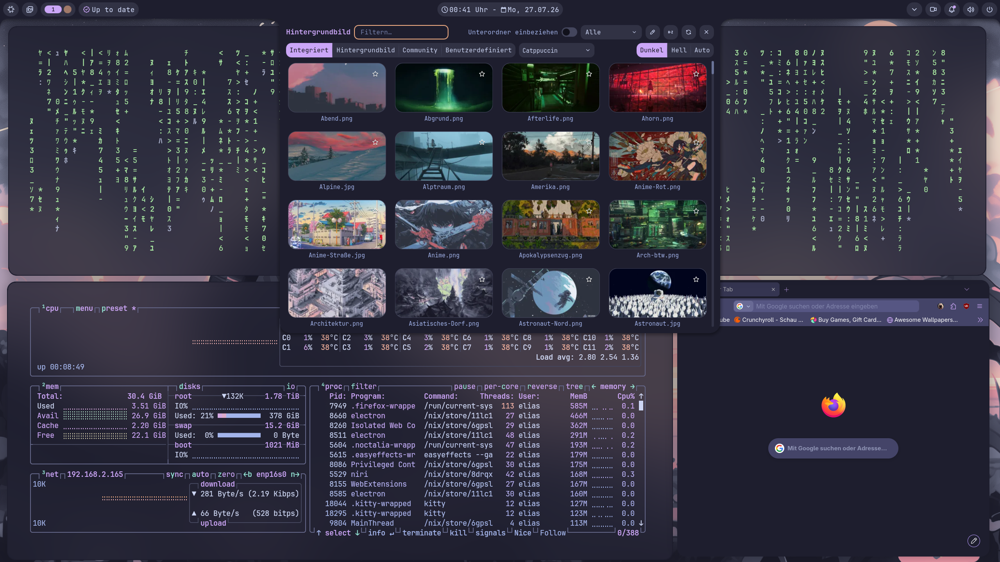

<div align="center">

# ❄️ NixOS · Niri · Noctalia

**My personal NNN-stack dotfiles** — a declarative, reproducible Wayland desktop
built on [NixOS](https://nixos.org), [Niri](https://github.com/YaLTeR/niri), and [Noctalia Shell](https://noctalia.dev).




</div>

---

## ✨ Overview

This repository is my daily-driver NixOS configuration, managed using a flake.
One `nixos-rebuild` gets the whole system — window manager, shell,
theming, and applications — into a known, reproducible state.

| Component        | Role                                                       |
|------------------|------------------------------------------------------------|
| **NixOS**        | Declarative OS, atomic upgrades, rollbacks                 |
| **Niri**         | Scrollable-tiling Wayland compositor                       |
| **Noctalia**     | OpenGL-based bar, launcher, notifications & lockscreen     |

---

## 🖥️ Features

- 🧩 Fully declarative system + (partly) user configuration via flakes and home-manager
- 🌀 Scrollable tiling with Niri — no floating chaos, no master/stack layout
- 🌙 Cohesive theme tying bar, launcher, notifications, and lockscreen together via Noctalia
- 🎨 Consistent theming across GTK/Qt app
- 📦 Modular structure — hosts, users, and shared modules kept separate
- 🔁 Reproducible: clone it on new hardware and boot the same desktop

---

## 📁 Structure

```
.
├── flake.lock
├── flake.nix
├── hosts
│   ├── gnome
│   │   ├── default.nix
│   │   ├── modules.nix
│   │   └── pkgs.nix
│   ├── kde
│   │   ├── default.nix
│   │   ├── modules.nix
│   │   └── pkgs.nix
│   └── wc
│       ├── default.nix
│       ├── modules.nix
│       └── pkgs.nix
├── lib
│   └── import-tree.nix
├── modules
│   ├── home-manager
│   │   ├── common-programs
│   │   │   ├── default.nix
│   │   │   ├── fish.nix
│   │   │   ├── starship.nix
│   │   │   └── vim.nix
│   │   ├── elias
│   │   │   ├── default.nix
│   │   │   ├── home.nix
│   │   │   ├── programs
│   │   │   │   └── fish.nix
│   │   │   └── xdg.nix
│   │   ├── gelias
│   │   │   ├── default.nix
│   │   │   ├── home.nix
│   │   │   └── programs
│   │   │       └── fish.nix
│   │   └── kdelias
│   │       ├── default.nix
│   │       ├── home.nix
│   │       └── programs
│   │           └── fish.nix
│   └── nixos
│       ├── default.nix
│       ├── options.nix
│       ├── programs
│       │   ├── dconf.nix
│       │   ├── firefox.nix
│       │   ├── fish.nix
│       │   ├── gamescope.nix
│       │   ├── git.nix
│       │   ├── gpu-screen-recorder.nix
│       │   ├── nh.nix
│       │   └── steam.nix
│       └── system
│           ├── amdgpu.nix
│           ├── boot.nix
│           ├── desktops
│           │   ├── gnome.nix
│           │   ├── hyprland.nix
│           │   ├── niri.nix
│           │   └── plasma6.nix
│           ├── environment.nix
│           ├── fonts.nix
│           ├── hardware.nix
│           ├── nix.nix
│           ├── noctalia-cachix.nix
│           ├── overlays
│           │   ├── noctalia.nix
│           │   ├── qt6ct-kde.nix
│           │   ├── sddm-astronaut.nix
│           │   └── swash.nix
│           ├── polkit.nix
│           ├── services.nix
│           ├── time.nix
│           ├── users
│           └── xkb.nix
├── patches
│   └── qt6ct-shenanigans.patch
├── systems
│   └── Apollo
│       ├── default.nix
│       ├── hardware-configuration.nix
│       └── networking.nix
└── users
    ├── elias
    │   ├── default.nix
    │   ├── home.nix
    │   └── user.nix
    ├── gelias
    │   ├── default.nix
    │   ├── home.nix
    │   └── user.nix
    └── kdelias
        ├── default.nix
        ├── home.nix
        └── user.nix
```

---

## 🚀 Installation

> ⚠️ This config is tailored to my hardware. You'll need to edit hardware-specific
> options before using it as-is, furthermore you will need to generated the hashed passwords tied to specific users into /etc/nixos.

```bash
# Clone the repo
git clone https://codeberg.org/eljangus/NixOS-Dots.git
cd NixOS-Dots

# Review and edit hardware-configuration.nix and host settings for your machine

# Rebuild
sudo nixos-rebuild switch --flake .#<hostname>
```

---

## ⌨️ Important Keybindings for Niri and Hyprland

| Keybind         | Action                   |
|-----------------|--------------------------|
| `Mod + Q`       | Open terminal            |
| `Mod + R`       | App launcher (Noctalia)  |
| `Mod + C`       | Close window             |
| `Mod + Scroll`  | Navigate workspaces      |

---

## 🙏 Credits

- [NixOS](https://nixos.org) — the declarative OS that makes this possible
- [Niri](https://github.com/YaLTeR/niri) — scrollable-tiling Wayland compositor
- [Noctalia Shell](https://noctalia.dev) — the desktop shell tying it all together
- [Noctalia Discord](https://discord.noctalia.dev/) - the people in the discord are super helpful and friendly and have inspired a me a lot in the creation of this setup
- Everyone in the NNN-stack community whose configs inspired parts of this one

---

## 📄 License

No license, use at your own risk.

