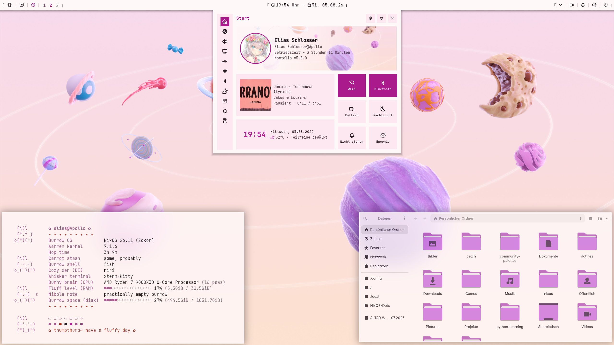

<div align="center">

# ❄️ nixos

**One machine. Three desktops. One module tree.**
*…with a nix-darwin branch growing on the side.*

</div>

<p align="center">
  &nbsp;
  &nbsp;
  
  <br/>
  &nbsp;
  &nbsp;
  &nbsp;
  &nbsp;
</p>

> [!NOTE]
> Application dotfiles (niri, noctalia, fastfetch, kitty) are managed
> imperatively and live [**here**](https://github.com/eljangus/dotfiles).

<div align="center">

## ❄️ NixOS · Niri · Noctalia

**The NNN stack** — running on `wc`.

 

</div>

---

## 🖥️ Hosts

All three build the same machine, **`Apollo`**, with a different desktop and
user bolted on top:

<div align="center">

| Host    | User      | Desktop     | Vibe                          |
| :-----: | :-------: | :---------: | :---------------------------- |
| `wc`    | `elias`   | Niri        | 🌊 the daily driver           |
| `kde`   | `kdelias` | Plasma 6    | 🧩 when I want every knob      |
| `gnome` | `gelias`  | GNOME       | 🪟 when I want none of them    |

</div>

```bash
nh os switch .#wc      # niri
nh os switch .#kde     # plasma 6
nh os switch .#gnome   # gnome
```

`darwinConfigurations.mac` exists in the flake, but integrating nix-darwin is
still very much a 🚧 **WIP**.

---

## 🗂️ Layout

<details>
<summary><b>The whole tree</b> (click to expand)</summary>

```
.
├── assets
│   └── screenshots
│       ├── 1.png
│       └── 2.png
├── hosts
│   ├── gnome
│   │   ├── default.nix
│   │   ├── modules.nix
│   │   └── pkgs.nix
│   ├── kde
│   │   ├── default.nix
│   │   ├── modules.nix
│   │   └── pkgs.nix
│   ├── mac
│   │   └── default.nix
│   └── wc
│       ├── default.nix
│       ├── modules.nix
│       └── pkgs.nix
├── lib
│   ├── import-tree.nix
│   └── mk-user.nix
├── modules
│   ├── common
│   │   ├── programs
│   │   │   ├── common-pkgs.nix
│   │   │   └── fish.nix
│   │   ├── system
│   │   │   ├── fonts.nix
│   │   │   ├── nix.nix
│   │   │   └── time.nix
│   │   ├── default.nix
│   │   └── options.nix
│   ├── darwin
│   │   └── default.nix
│   ├── home-manager
│   │   ├── common-programs
│   │   │   ├── default.nix
│   │   │   ├── fish.nix
│   │   │   ├── git.nix
│   │   │   ├── man.nix
│   │   │   ├── nh-darwin.nix
│   │   │   ├── nvf.nix
│   │   │   └── starship.nix
│   │   ├── elias
│   │   │   ├── default.nix
│   │   │   └── xdg.nix
│   │   └── melias
│   │       └── default.nix
│   └── nixos
│       ├── programs
│       │   ├── dconf.nix
│       │   ├── desktop-pkgs.nix
│       │   ├── firefox.nix
│       │   ├── gamescope.nix
│       │   ├── gpu-screen-recorder.nix
│       │   ├── nh.nix
│       │   ├── steam.nix
│       │   └── tack.nix
│       ├── system
│       │   ├── desktops
│       │   │   ├── gnome.nix
│       │   │   ├── hyprland.nix
│       │   │   ├── niri.nix
│       │   │   ├── plasma6.nix
│       │   │   └── sddm.nix
│       │   ├── overlays
│       │   │   ├── glaze.nix
│       │   │   ├── qt6ct-kde.nix
│       │   │   ├── sddm-astronaut.nix
│       │   │   └── swash.nix
│       │   ├── amdgpu.nix
│       │   ├── boot.nix
│       │   ├── environment.nix
│       │   ├── hardware.nix
│       │   ├── locale.nix
│       │   ├── openssh.nix
│       │   ├── polkit.nix
│       │   ├── services.nix
│       │   └── xkb.nix
│       ├── default.nix
│       └── options.nix
├── patches
│   └── qt6ct-shenanigans.patch
├── systems
│   ├── Apollo
│   │   ├── default.nix
│   │   ├── hardware-configuration.nix
│   │   ├── modules.nix
│   │   └── networking.nix
│   └── Mac
│       ├── default.nix
│       └── modules.nix
├── .tack
│   ├── default.nix
│   ├── pins.lock.json
│   └── pins.toml
└── flake.nix
```

</details>

**The short version:**

| Directory        | What lives there                                            |
| :--------------- | :---------------------------------------------------------- |
| `hosts/`         | Per-desktop entry points — which modules, which packages      |
| `systems/`       | Per-machine hardware, networking, machine-wide toggles        |
| `modules/`       | The actual configuration, split by platform                   |
| `lib/`           | `import-tree` and `mk-user`, the two bits of glue             |
| `.tack/`         | Input pins — the real lockfile                                |

---

## 📐 Conventions

### The platform split is structural

`modules/common` is imported by both `nixosSystem` and `darwinSystem`;
`modules/nixos` and `modules/darwin` only by their own.

> [!IMPORTANT]
> This is not a stylistic choice. `lib.mkIf` does not protect against options
> that do not exist. The module system pushes the condition down to the leaves
> _before_ checking option paths, so a disabled `mkIf false { boot.loader… = …; }`
> still registers `boot` as a defined attribute — and nix-darwin will reject it.
> A module touching a NixOS-only option therefore has to be **physically absent**
> from the Darwin evaluation, not merely switched off.

**Rule of thumb for a new module:** if every option path it writes to exists in
both NixOS and nix-darwin **and** every package it pulls in builds on both, it
belongs in `common`. Otherwise `nixos` (or `darwin`).

Cross-platform user-level things — git, nvf, starship — live in
`modules/home-manager` instead, which sidesteps the question entirely.

### Options

Modules are toggled through a single option namespace, declared in
`modules/common/options.nix` for the shared modules and
`modules/nixos/options.nix` for the Linux-only ones:

```nix
# example
myModules = {
  desktop = "niri";
  system.overlays.enable = true;
  programs.gpu-screen-recorder.enable = true;
};
```

Every module is one `lib.mkIf` guarded on its own option, with nothing outside
the guard. Most default to on; `gamescope`, `gpu-screen-recorder`, `openrgb`,
`polkit`, `udev` and the overlays are opt-in and get switched on per host in
`hosts/*/modules.nix` or `systems/Apollo/modules.nix`.

### Adding a module

`lib/import-tree.nix` imports each directory recursively, skipping `default.nix`
and any file prefixed with `_`. So a new module is:

1. a new file, and
2. its option declaration in the matching `options.nix`.

That's it. No import list to update.

### Users

`lib/mk-user.nix` produces both the system account and the home-manager config
from a name and a host. Darwin differences — home under `/Users`, no
`isNormalUser`, `nh darwin` instead of `nh os` — are handled inside it.

### Inputs

Pinned with [**tack**](https://github.com/manic-systems/tack), so
`.tack/pins.toml` is the source of truth and `nix flake update` does nothing.
`tack update` refreshes the lock.

---

## 🧪 Using it

> [!WARNING]
> This is tailored to my hardware. Copying it wholesale will not boot your
> machine.

Before the first switch you'd need to:

- [ ] Replace `systems/Apollo/hardware-configuration.nix`
- [ ] Review `systems/Apollo/modules.nix`
- [ ] Set your own name and email in
      `modules/home-manager/common-programs/git.nix`
- [ ] Place hashed password files at `/etc/nixos/secrets/<user>.txt`

---

## 💜 Credits

Big thanks to the people in the **#nixos** channel of the
[**Noctalia Discord**](https://github.com/noctalia-dev/noctalia-shell) — for the
inspiration, the shared configs, the "why is `mkIf` doing that" debugging
sessions, and generally for making the rabbit hole a much more pleasant place to
fall down. A lot of what's in this repo started as something someone posted
there.

---

## 📄 License

[MIT](LICENSE). Do what you like.

<div align="center">
<sub>built with ❄️ and far too many rebuilds</sub>
</div>
